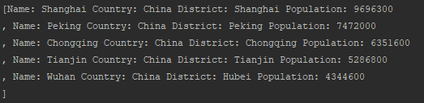
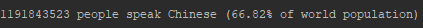

#Software Engineering Methods

- Master Build Status 
- Develop Build Status 
- License 
- Release 
- Code Coverage 

Usage:
 Stop running docker containers and delete app and db images.
 - Open Maven panel on the right
 - Click Compile, wait to finish
 - Click Package, wait to finish
 - In terminal, run "docker-compose run app"
 - Profit
 
 25 requirements of 32 have been implemented, which is 78.13%.
 
 
 | ID  | Name          | Met           | Screenshot     |
  | ---|:-------------:| -------------:| --------------:|
  | 1  | Generate report with the population of a city |          Yes |            |
  | 2  | Generate report with the population of a district |          Yes |            |
  | 3  | Generate report with the population of a country|          Yes |            |
  | 4  | Generate report with the population of a region |          Yes |            |
  | 5  | Generate report with the population of a continent |          Yes |           |
  | 6  | Generate report with the population of the world |          Yes |            |
  | 7  | Generate report with the population of people, people living in cities, and people not living in cities in each country |          Yes |            |
  | 8  | Generate report with the population of people, people living in cities, and people not living in cities in each region |          Yes |            |
  | 9  | Generate report with the population of people, people living in cities, and people not living in cities in each continent |          Yes |            |
  | 10 | Generate report with the top N populated cities in a district where N is provided by the user |          Yes |            |
  | 11 | Generate report with the top N populated cities in a country where N is provided by the user. |          Yes |            |
  | 12 | Generate report with the top N populated cities in a region where N is provided by the user |          Yes |            |
  | 13 | Generate report with the top N populated cities in a continent where N is provided by the user |          Yes |            |
  | 14 | Generate report with the top N populated cities in the world where N is provided by the user |          Yes |            |
  | 15 | Generate report with the top N populated countries in a continent where N is provided by the user |          Yes |            |
  | 16 | Generate report with the top N populated countries in the world where N is provided by the user |          Yes |            |
  | 17 | Generate report with all the countries in a region organised by largest population to smallest |          Yes |            |
  | 18 | Generate report with all the countries in a continent organised by largest population to smallest |          Yes |            |
  | 19 | Generate a report with all the countries in the world organised by largest population to smallest |          Yes |            |
  | 20 | Generate report with the top N populated countries in a region where N is provided by the user. |          Yes |            |
  | 21 | Generate report for Arabic |          Yes |            |
  | 22 | Generate report for Spanish |          Yes |            |
  | 23 | Generate report for Hindi |          Yes |            |
  | 24 | Generate report for English |          Yes |            |
  | 25 | Generate Report for Chinese |          Yes |            |
  | 26 | Generate report with the top N populated capital cities in a region where N is provided by the user |          No |           - |
  | 27 | Generate report with the top N populated capital cities in a continent where N is provided by the user |          No |           - |
  | 28 | Generate report with the top N populated capital cities in the world where N is provided by the user |          No |           - |
  | 29 | Generate report with all the capital cities in a region organised by largest to smallest |          No |           - |
  | 30 | Generate report with all the capital cities in a continent organised by largest population to smallest. |          No |           - |
  | 31 | Generate report with all the capital cities in the world organised by largest population to smallest |          No |           - |
  | 32 |           |           |            |
 
 
 
 
 
 
 
 |                 | Code Review 1 | Code Review 2 | Code Review 3  | Code Review 4  | Final Deliverable | Average        |
 | ----------------|:-------------:| -------------:| --------------:| --------------:| -----------------:| --------------:|
 | Andrey Tsarev   |          0.25 |          0.25 |           0.25 |           0.50 |               0.4 |           0.33 |
 | Albert Jacmenov |          0.25 |          0.25 |           0.25 |          0.167 |               0.2 |          0.223 |
 | Martin Lipchev  |          0.25 |          0.25 |           0.25 |          0.167 |               0.2 |          0.223 |
 | Marcos De Faria Perez|     0.25 |          0.25 |           0.25 |          0.167 |               0.2 |          0.223 |
